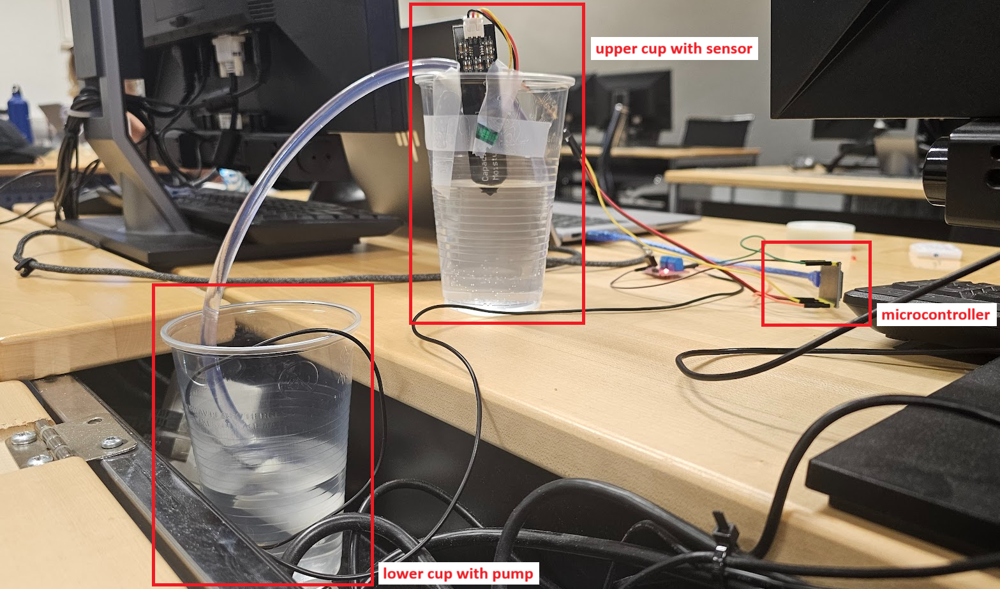
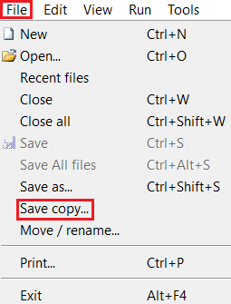
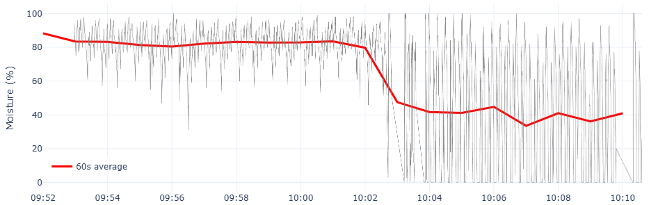

# One-Pager
This report was created as a submission for the [IoT Lab course](https://mciwing.github.io/micropython/) course. The code is available in the linked [GitHub repository](https://github.com/ThoAus/wing_iot_lab.git).

## Experiment Procedure
The individual steps are not described in detail here, as they are thoroughly covered in the provided instructions and were followed accordingly. Only deviations and additions to the procedure are described below.

## Experimental Setup
The cups were positioned at different heights, with water being pumped from the lower cup to the higher one. The moisture sensor was placed in the higher cup. As the water flows back, the drying of the soil is simulated. This allows the microcontroller to control the process automatically, without constant manual intervention.

## Issue with 'pymakr' Plugin
There were issues using the VS Code plugin 'pymakr' to upload scripts to the microcontroller. The transfer process repeatedly stalled at a certain point. Restarting, reinstalling the plugin, and reinstalling MicroPython on the ESP32 did not resolve the problem. Since troubleshooting was unsuccessful and the error occurred in about 19 out of 20 attempts without a clear pattern, the decision was made to switch to the 'Thonny' software. Although scripts must be uploaded individually to the microcontroller, this is not a significant drawback for a small project. The transfer works reliably when the microcontroller is connected and stopped with 'Ctrl + C', using 'File' > 'Save copy...'.

## Data Recording
In addition to displaying the data on the dashboard, the values measured by the microcontroller are also recorded to verify the system's operation. In the first step, MQTT messages are saved to a [text file](/messages.txt) using [01_mqtt_communication.ipynb](/01_mqtt_communication.ipynb). The timestamp is added upon data reception, as this is only a conceptual demonstration and avoids modifying the microcontroller code or the dashboard. In the second step, the data is imported and visualized over time in the Jupyter notebook [02_plot_messages.ipynb](/02_plot_messages.ipynb). For easier interpretation, the values are aggregated into one-minute intervals. During data recording, the threshold for activating the pump was changed from 80% to 30%. This change in the average moisture level is clearly visible in the diagram.

## Next Steps
A possible next step would be to send MQTT messages for control directly from the Python script. A dashboard could be created using Dash and Plotly, allowing parameters of the control system to be adjusted based on the average moisture level.